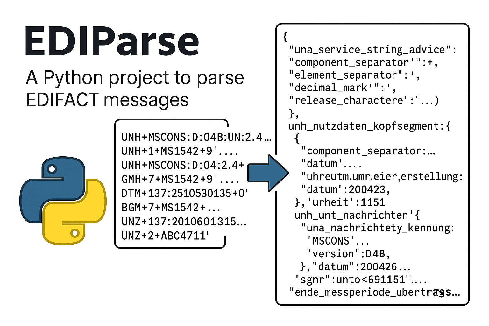
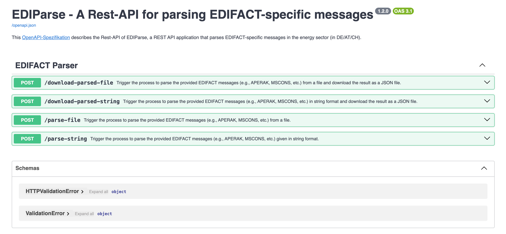

# EDIParse – A Fast and Extensible EDIFACT-to-JSON REST API

**EDIParse** is a lightweight and extensible REST API service that parses **EDIFACT message** text inputs or files
(e.g. APERAK, MSCONS, etc.) and returns structured JSON output. Built with Python and Pydantic, the service offers
type-safe, high-performance parsing for energy and logistics data exchange formats.

## Key Features
- 📦 CURRENTLY, only supports EDIFACT message types: **MSCONS**, **APERAK**
- 🔄 Converts raw EDIFACT into clean, nested JSON structures
- 🧩 Fully extensible architecture using clean and hexagonal architecture concept
- 🔥 FastAPI-powered REST endpoints
- 📐 Pydantic v2 for modern data validation and serialization
- ⛓️ Easy integration into existing microservices and ETL pipelines



# Development Guidelines for the Rest-API EDIFACT Message Parser

This document provides guidelines and instructions for developing and maintaining the EDIParse project.

## Build and Configuration Instructions

### OpenAPI generated FastAPI server components

This Python project uses [OpenAPI Generator](https://openapi-generator.tech) to generate the API endpoints (DTOs and
router endpoints) while the core business logic is manually created following a clean (hexagonal) architecture pattern:

- Generator version: 7.14.0-SNAPSHOT (project's latest from current commit)
- Build package: org.openapitools.codegen.languages.PythonFastAPIServerCodegen

> NOTE: Before starting the project, please generate the missing APIs first, see
> [generate-openapi-endpoints.md](docs/generate-openapi-endpoints.md)
> otherwise, the application will not be built properly!

### Local Development Setup

1. **Python Version**: This project requires Python 3.9 or higher.

2. **Virtual Environment Setup**:
   ```bash
   # Create a virtual environment named .venv
   python -m venv .venv

   # Activate the virtual environment
   # On Windows:
   #.venv\Scripts\activate

   # On macOS/Linux:
   source .venv/bin/activate
   ```

3. **Dependencies Installation**:
   > NOTE: Please execute the following from the root directory with the virtual environment activated!

   ```bash
   # Install uv if not already installed
   pip install uv

   # Install dependencies using uv
   uv pip install -e .

   # For development dependencies
   uv pip install -e ".[dev]"
   ```

   > NOTE: This project uses pyproject.toml for dependency management with the uv package manager.

3. **Running the Application**:

   You can run the application in several ways:

   **With uv**:
   ```bash
   # Install dependencies and start the application
   uv pip install -e .
   PYTHONPATH=src uv run -m uvicorn ediparse.main:app --host 0.0.0.0 --port 8000
   ```

   **Without uv** (should work in most of the cases):
   ```bash
   # Install dependencies and start the application
   pip install -e .
   PYTHONPATH=src python -m uvicorn ediparse.main:app --host 0.0.0.0 --port 8000
   ```

   **Direct execution with uvicorn** (should work in most of the cases):
   ```bash
   # After installing dependencies
   PYTHONPATH=src uvicorn ediparse.main:app --host 0.0.0.0 --port 8000
   ```

   Or simply (if you have added the module `ediparse` to your working environment):
   ```bash
   uvicorn ediparse.main:app --host 0.0.0.0 --port 8000
   ```

   After starting the application, open your browser at `http://0.0.0.0:8000/docs/` to see the API documentation.

### Docker Setup

To run the server on a Docker container, please execute the following from the root directory:

1. **Building the Docker Image**:
   ```bash
   docker build -t ediparse .
   ```

   The Dockerfile uses a multi-stage build process:
   - `openapi_generator` stage: Generates API endpoints from OpenAPI specification
   - `builder` stage: Installs the application and dependencies
   - `test_runner` stage: Runs the tests
   - `service` stage: Creates the final image for deployment

   For detailed information about the Docker build process, including important notes about file copying and known
   issues, see the [Docker Build Process Documentation](docs/docker-build-process.md).

2. **Running with Docker Compose**:
   ```bash
   docker compose up
   ```
   ```bash
   # or including the build
   docker compose up --build
   ```

   This will start the service on port 8000, which maps to the internal port 8000.


> **Performance Optimization**:
> 
> The project is configured to use Docker Compose's bake feature for better build performance.
> This is enabled by the `COMPOSE_BAKE=true` environment variable in the `.env` file.
> No additional action is required.

## Testing Information

### Running Tests

1. Running all tests with pytest:
   ```bash
   python -m pytest
   ```

2. Running all tests with unittest (standard library):
   ```bash
   python -m unittest discover -s tests -v
   ```

3. Running a specific test module:
   ```bash
   python -m pytest tests/ediparse/infrastructure/libs/edifactparser/test_edifact_parser.py
   ```

4. Notes:
   - The repository includes both pytest- and unittest-style tests. If you encounter environment-specific pytest plugin/dependency issues, use the unittest command above as a fallback.

### Adding New Tests

1. **Test Structure**:
   - Place test files in the `tests` directory
   - Use the naming convention `test_*.py` for test files
   - Use unittest or pytest style tests (the project uses both, unittest is preferred)

2. **Sample Tests**:
   ```python
   import os
   import unittest
   from pathlib import Path

   from ediparse.infrastructure.libs.edifactparser.parser import EdifactParser


   class TestSimpleEdifactParsers(unittest.TestCase):
       """A simple test case to demonstrate testing in this project."""

       def setUp(self):
           """Set up test fixtures before each test method."""
           self.parser = EdifactParser()
           self.samples_dir = Path(os.path.dirname(os.path.dirname(os.path.abspath(__file__)))) / "tests" / "samples"
           self.aperak_sample_file_path_request = self.samples_dir / "aperak-message-example-request.txt"
           self.mscons_sample_file_path_request = self.samples_dir / "mscons-message-example-request.txt"

       def test_parse_aperak_sample_file(self):
           """Test that the parser can parse the sample file."""
           # Read the sample file
           file_path = self.aperak_sample_file_path_request

           with open(file_path, encoding='utf-8') as f:
               edifact_data = f.read()

           # Parse the data
           parsed_object = self.parser.parse(edifact_data)

           # Verify some basic properties
           self.assertIsNotNone(parsed_object)
           self.assertEqual(parsed_object.unz_nutzdaten_endsegment.datenaustauschzaehler, 1)
           self.assertEqual(len(parsed_object.unh_unt_nachrichten), 1)

       def test_parse_mscons_sample_file(self):
           """Test that the parser can parse the sample file."""
           # Read the sample file
           file_path = self.mscons_sample_file_path_request

           with open(file_path, encoding='utf-8') as f:
               edifact_data = f.read()

           # Parse the data
           parsed_object = self.parser.parse(edifact_data)

           # Verify some basic properties
           self.assertIsNotNone(parsed_object)
           self.assertEqual(parsed_object.unz_nutzdaten_endsegment.datenaustauschzaehler, 2)
           self.assertEqual(len(parsed_object.unh_unt_nachrichten), 2)
   ```

3. **Test Fixtures**:
   - The project uses pytest fixtures defined in `tests/conftest.py`
   - These fixtures provide a FastAPI test client for API testing

4. **Sample Data**:
   - Sample EDIFACT messages are provided in the `tests/samples` directory:
     - MSCONS messages: [mscons-message-example-request.txt](tests/samples/mscons-message-example-request.txt)
     - APERAK messages: [aperak-message-example-request.txt](tests/samples/aperak-message-example-request.txt)
   - Use these for testing or create new ones as needed

### Testing Conventions

- Use Arrange, Act, Verify (AAA) style for tests to improve readability and maintainability.
- The project contains both unittest and pytest tests; unittest is preferred for unit tests.
- When testing segment handlers, initialize the converter via the name-mangled private attribute on the handler instance:
  ```python
  handler._SegmentHandler__converter = SomeSegmentConverter(syntax_helper)
  ```
  This mirrors production behavior where converters are auto-detected but keeps tests deterministic.
- New unit tests were added for GroupStateResolver and GroupStateResolverFactory; follow similar minimal, focused testing patterns.

## Code Style and Development Guidelines

1. **Code Style**:
   - The project uses flake8 for linting
   - Maximum line length is 120 characters
   - Run flake8 to check for style issues:
     ```bash
     flake8 src tests
     ```

2. **Project Structure**:
   - The project follows a hexagonal (clean) architecture pattern:

         EDIParse                          # the root folder
         ├── docs                             # contains documentation related to this project, e.g.: openapi specs, how-to guides, etc.
         ├── scripts                          # helper scripts that can supports the project
         ├── src                              # the source code folder
         │   └── ediparse                     # main package folder
         │       ├── adapters                 # adapter folder
         │       │   └── inbound              # Contains inbound adapters
         │       │       └── rest             # Inbound REST API implementation
         │       │           ├── apis         # **generated** from openapi-spec (not git commited)
         │       │           ├── impl         # custom implementation of the adapters, contains controllers, routers, filters, etc.
         │       │           └── models       # **generated** from openapi-spec (not git commited)
         │       ├── application              # Contains application services and use cases
         │       │   ├── services             # Contains service classes that orchestrate the business logic
         │       │   └── usecases             # Contains use case implementations of inbound ports
         │       ├── domain                   # Contains the domain models and interfaces
         │       │   ├── models               # Contains domain models of the business logic
         │       │   └── ports                # Contains domain interfaces (inbound/outbound ports)
         │       │       └── inbound          # Contains inbound ports (interfaces implemented by use cases)
         │       └── infrastructure           # Contains infrastructure components
         │           └── libs                 # Contains library code that can be extracted as separate packages
         │               └── edifactparser    # Parser library for EDIFACT specific messages
         │                   ├── converters   # Contains segment converters
         │                   ├── exceptions   # Contains parser-specific exceptions
         │                   ├── handlers     # Contains segment handlers
         │                   ├── mods         # Contains message-specific implementations
         │                   │   ├── aperak   # Contains APERAK-specific implementations (see specific documentation)
         │                   │   └── mscons   # Contains MSCONS-specific implementations (see specific documentation)
         │                   ├── resolvers    # Contains segment group resolvers
         │                   ├── utils        # Contains utility and helper functions
         │                   └── wrappers     # Contains library model wrappers
         │                       └── segments # Contains common and global wrappers shared between message types
         └── tests                            # Contain all tests of the project

> NOTE: Thus our root domain code source is `src/ediparse`.

3. **Parser Implementation**:
   - The parser follows the hexagonal architecture with a clear separation between the application and domain layers
   - The application layer contains the `ParserService` which uses the `ParseMessageUseCase` to parse EDIFACT messages
   - The `ParseMessageUseCase` implements the `MessageParserPort` interface from the domain layer
   - The actual parsing logic is implemented in the `libs/edifactparser` package
   - The parser uses a factory pattern to handle different segment types and message types
   - Each segment type has its own converter in `libs/edifactparser/converters` and handlers in
     `libs/edifactparser/handlers`
   - Each message type has its own resolver in `libs/edifactparser/mods/{message_type}/group_state_resolver.py`
   - The main parser class is:
     - `EdifactParser` in `libs/edifactparser/parser.py` for all EDIFACT message types
   - The parser uses two factory classes:
     - `SegmentHandlerFactory` for creating handlers for different segment types
     - `GroupStateResolverFactory` for creating resolvers for different message types
   - Domain models are located in:
     - `libs/edifactparser/wrappers/segments` for common and global segments
     - `libs/edifactparser/wrappers/aperak/segments` for APERAK-specific segments
     - `libs/edifactparser/wrappers/mscons/segments` for MSCONS-specific segments
   - Library related exceptions are defined in `libs/edifactparser/exceptions` and use these exceptions for
     library-specific error handling
   - For a detailed explanation of the parsing process, see [MSCONS Parsing Process Documentation](docs/mscons-parsing-process.md) and
     [APERAK Parsing Process Documentation](docs/aperak-parsing-process.md)
   - For information about how the parser fits into the overall system architecture, see
     [Architecture Documentation](docs/architecture.md)

4. **API Implementation**:
   - The API is implemented using FastAPI
   - The OpenAPI specification is in `docs/ediparse.openapi.yaml`
   - The generated API endpoints are defined in `adapters/inbound/rest/apis`
   - The custom implementation of the controllers/routers are in `adapters/inbound/rest/impl` and for the business
     logic it is the `domain` directory
   - For details on API generation, see [section openapi-generated-fastapi-server-components](#openapi-generated-fastapi-server-components)

## Deployment

1. **Docker Deployment**:
   - The application is containerized and can be deployed using Docker
   - The Docker image exposes port `8000`
   - Use the provided docker-compose.yaml for simple testings and deployments

2. **Environment Variables**:
   - The application uses environment variables for configuration
   - These can be set in the docker-compose.yaml file or passed to the container

## Versioning

This project follows [Semantic Versioning 2.0.0](https://semver.org/) principles with a specific adaptation for the EDFIACT Parser
Restify specification version.

### Version Format

The version format is `MAJOR.MINOR.PATCH` where:

    1 . 2 . 0
    |   |   |
    1---|---|--> **MAJOR**: Incremented when making incompatible API changes
        2---|--> **MINOR**: Contains the specification version
            0--> **PATCH**: Incremented when making backward compatible bug fixes

### Current Version

The current version can be found in the [pyproject.toml](pyproject.toml) file. 

### Version Consistency

There are several important places specifying the version numbers in this project:

1. **Project Version**: Defined in  [`pyproject.toml`](pyproject.toml)
2. **API Version**: Defined in the [project's OpenAPI specification](docs/ediparse.openapi.yaml)
2. **Version on OpenCode**: Defined in the [publiccode.yml](publiccode.yml)

Please ensure those places contain the same version number when a new version is released.

### When to Update Versions

- Increment the **MAJOR** version when you make incompatible API changes
- Update the **MINOR** version when the supported EDIFACT message type specification version changes or
  introducing new EDIFACT-specific messages
- Increment the **PATCH** version when you make backward compatible bug fixes or enhancements

## Documentation

The project includes comprehensive documentation:

- [Architecture Documentation](docs/architecture.md): Provides an overview of the system architecture, including the hexagonal
  architecture pattern, building blocks, and architectural decisions.
- [MSCONS Parsing Process Documentation](docs/mscons-parsing-process.md): Describes the business logic for parsing EDIFACT MSCONS messages,
  including the parser architecture, segment types, handlers, converters, and how to extend the parser.
- [APERAK Parsing Process Documentation](docs/aperak-parsing-process.md): Describes the business logic for parsing EDIFACT APERAK messages,
  including the parser architecture, segment types, handlers, converters, and how to extend the parser.

### Additional Utilities

The project also includes additional utilities:

- [API Generation Documentation](docs/generate-openapi-endpoints.md): Explains how to generate the API endpoints from
  the OpenAPI specification.

## License

This project is licensed under the [Apache-2.0 license](LICENSE.txt).

## Contributing

We welcome contributions to improve EDIParse! There are several ways you can contribute to the project:

- **Report bugs**: If you find a bug, please open an issue with a detailed description.
- **Suggest features**: Do you have ideas for new features? Share them by creating an issue.
- **Contribute code**: Pull requests for bug fixes or new features are always welcome.

For detailed information on how to contribute, please refer to our [`CONTRIBUTING.md`](CONTRIBUTING.md) file:
- The CONTRIBUTING.md file contains comprehensive guidelines and instructions for anyone who wants to contribute to
  the project and participate in the development process.

## Last words

> Please refer to project documentation and scripts in the [docs](docs) and [scripts](scripts) directories for more
> details.
